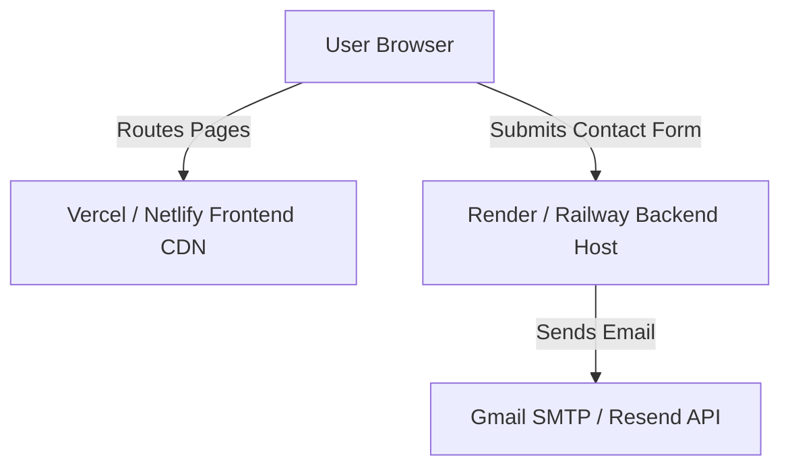

# Personal Portfolio Production Readiness Guide

This comprehensive guide outlines the exact roadmap to transition your personal portfolio from a local development project to a robust, highly secure, and performance-optimized **production-ready web application**. 

All proposals below **strictly preserve your existing core approach** (Vite + React frontend with a dark glassmorphic theme and Tailwind CSS, coupled with an Express.js backend).

---

## 📋 Table of Contents
1. [Architecture & Project Analysis](#1-architecture--project-analysis)
2. [Secure Contact Form Integration (Full-Stack vs Serverless)](#2-secure-contact-form-integration-full-stack-vs-serverless)
3. [Backend Security & Quality Assurance (Express)](#3-backend-security--quality-assurance-express)
4. [Production environment & Deployment Blueprint](#4-production-environment--deployment-blueprint)
5. [Advanced Premium Features to Add](#5-advanced-premium-features-to-add)
6. [SEO & Social Optimization](#6-seo--social-optimization)
7. [Performance & Asset Optimization](#7-performance--asset-optimization)

---

## 1. Architecture & Project Analysis

Your current portfolio features a clean and modern design:
*   **Frontend (`/client`)**: React + Vite + Tailwind CSS. Uses dynamic keyframes and transition classes (`card-hover-soft`, `card-glow`, `card-pressable`) for smooth interactive states, and `react-router-dom` for client-side routing.
*   **Backend (`/server`)**: A simple, lightweight Node/Express server. Currently has only boilerplate `/` and `/api/health` routes.
*   **Missing Production Features**:
    1.  **Functional Contact Form**: The frontend page lists links but does not have an interactive, secure contact form.
    2.  **API Rate Limiting & Safety**: The backend has no rate-limiting, CORS origin restrictions, or input sanitization.
    3.  **Dynamic Content Management**: Projects, education, and activities are hardcoded in the frontend.
    4.  **SEO Metadata**: Lack of dynamic metadata tags, Open Graph card tags, and robots/sitemap setup.

---

## 2. Secure Contact Form Integration (Full-Stack vs Serverless)

To add the **Contact Form**, you have two main approaches. Both fit beautifully into your architecture:

### Approach A: Full-Stack (Using your Express Server)
Perfect if you want to keep full control of your server, write custom backend validation, and avoid relying on external limits of standard email-sending plans.

#### 1. Express Backend Setup (`/server`)
You need to install the following dependencies in the `server` directory:
```bash
npm install nodemailer express-rate-limit express-validator dotenv cors
```

Here is the robust, secure Express endpoint to append to your [server/index.js](file:///c:/Users/HP/Desktop/coding-v1/07-projects-all/Portfolio_Delta_theta/Portfolio_v2/server/index.js):

```javascript
import { body, validationResult } from 'express-validator';
import rateLimit from 'express-rate-limit';
import nodemailer from 'nodemailer';

// 1. Rate limiter to prevent spam attacks on your email endpoint
const contactLimiter = rateLimit({
  windowMs: 15 * 60 * 1000, // 15 minutes
  max: 5, // Limit each IP to 5 requests per window
  message: { message: "Too many messages sent from this IP, please try again after 15 minutes." }
});

// 2. Nodemailer transport setup using environment variables
const transporter = nodemailer.createTransport({
  service: 'gmail', // or Resend, SendGrid, etc.
  auth: {
    user: process.env.EMAIL_USER,
    pass: process.env.EMAIL_PASS, // App password (not regular password)
  },
});

// Verify connection configuration
transporter.verify((error, success) => {
  if (error) {
    console.error("Nodemailer configuration error:", error);
  } else {
    console.log("Mail server is ready to deliver messages");
  }
});

// 3. Contact Form Endpoint with validation and sanitization
app.post(
  '/api/contact',
  contactLimiter,
  [
    body('name').trim().notEmpty().withMessage('Name is required').escape(),
    body('email').isEmail().withMessage('Please enter a valid email address').normalizeEmail(),
    body('subject').trim().notEmpty().withMessage('Subject is required').escape(),
    body('message').trim().notEmpty().withMessage('Message is required').escape(),
  ],
  async (req, res) => {
    const errors = validationResult(req);
    if (!errors.isEmpty()) {
      return res.status(400).json({ errors: errors.array() });
    }

    const { name, email, subject, message } = req.body;

    // Email template structure (HTML formatted)
    const mailOptions = {
      from: `"${name}" <${process.env.EMAIL_USER}>`,
      to: process.env.EMAIL_RECEIVER || process.env.EMAIL_USER,
      replyTo: email,
      subject: `Portfolio Contact: ${subject}`,
      html: `
        <div style="font-family: Arial, sans-serif; padding: 20px; color: #333; line-height: 1.6;">
          <h2 style="color: #3b82f6; border-bottom: 2px solid #eaeaea; padding-bottom: 8px;">New Contact Message</h2>
          <p><strong>From:</strong> ${name} (&lt;${email}&gt;)</p>
          <p><strong>Subject:</strong> ${subject}</p>
          <div style="margin-top: 20px; padding: 15px; background-color: #f9f9f9; border-left: 4px solid #3b82f6; font-style: italic;">
            ${message.replace(/\n/g, '<br>')}
          </div>
          <hr style="border: 0; border-top: 1px solid #eaeaea; margin-top: 30px;" />
          <p style="font-size: 11px; color: #888;">Submitted via Personal Portfolio V2</p>
        </div>
      `
    };

    try {
      await transporter.sendMail(mailOptions);
      res.status(200).json({ message: "Thank you! Your message has been sent successfully." });
    } catch (error) {
      console.error("Nodemailer error:", error);
      res.status(500).json({ message: "Internal server error. Failed to send mail. Please try again later." });
    }
  }
);
```

#### 2. Gorgeous React Frontend Integration (`/client`)
Replace the contents of [Contact.jsx](file:///c:/Users/HP/Desktop/coding-v1/07-projects-all/Portfolio_Delta_theta/Portfolio_v2/client/src/pages/Contact.jsx) with a highly interactive, responsive form designed to fit your portfolio's premium dark glassmorphism aesthetic:

```jsx
import { useState } from "react";
import LinkedInIcon from "@mui/icons-material/LinkedIn";
import GitHubIcon from "@mui/icons-material/GitHub";
import EmailIcon from "@mui/icons-material/Email";
import ArticleIcon from "@mui/icons-material/Article";
import SendIcon from "@mui/icons-material/Send";
import CheckCircleIcon from "@mui/icons-material/CheckCircle";
import ErrorIcon from "@mui/icons-material/Error";

export default function Contact() {
  const [formData, setFormData] = useState({ name: "", email: "", subject: "", message: "" });
  const [status, setStatus] = useState({ loading: false, success: null, error: null });

  const handleChange = (e) => {
    setFormData({ ...formData, [e.target.name]: e.target.value });
  };

  const handleSubmit = async (e) => {
    e.preventDefault();
    setStatus({ loading: true, success: null, error: null });

    const apiUrl = import.meta.env.VITE_API_URL || "http://localhost:5000";

    try {
      const response = await fetch(`${apiUrl}/api/contact`, {
        method: "POST",
        headers: { "Content-Type": "application/json" },
        body: JSON.stringify(formData),
      });

      const data = await response.json();

      if (response.ok) {
        setStatus({ loading: false, success: data.message, error: null });
        setFormData({ name: "", email: "", subject: "", message: "" }); // Reset form
      } else {
        const errorMsg = data.errors ? data.errors.map(err => err.msg).join(", ") : data.message;
        setStatus({ loading: false, success: null, error: errorMsg || "Something went wrong" });
      }
    } catch (err) {
      console.error(err);
      setStatus({
        loading: false,
        success: null,
        error: "Failed to connect to the server. Please check your internet connection.",
      });
    }
  };

  return (
    <section className="pt-28 pb-20 px-6 max-w-6xl mx-auto text-white">
      <h1 className="text-4xl font-bold mb-10">Get In Touch</h1>

      <div className="grid md:grid-cols-5 gap-10">
        
        {/* Info Column */}
        <div className="md:col-span-2 space-y-6">
          <div className="bg-white/5 border border-white/10 p-6 rounded-2xl backdrop-blur-md">
            <h2 className="text-2xl font-semibold mb-4 text-blue-400">Let's Connect</h2>
            <p className="text-gray-300 leading-relaxed mb-6 text-sm">
              Feel free to reach out for project discussions, job opportunities, 
              or simply to network. I'm always open to meaningful engineering conversations.
            </p>

            <div className="space-y-4">
              <a href="mailto:arpitdeshmukh21@gmail.com" className="flex items-center gap-3 text-gray-300 hover:text-blue-400 transition-colors group">
                <span className="p-2 rounded-lg bg-blue-500/10 text-blue-400 group-hover:bg-blue-500/20"><EmailIcon fontSize="small" /></span>
                <span className="text-sm">arpitdeshmukh21@gmail.com</span>
              </a>

              <a href="https://www.linkedin.com/in/arpit-deshmukh-08877227a/" target="_blank" rel="noopener noreferrer" className="flex items-center gap-3 text-gray-300 hover:text-blue-400 transition-colors group">
                <span className="p-2 rounded-lg bg-blue-500/10 text-blue-400 group-hover:bg-blue-500/20"><LinkedInIcon fontSize="small" /></span>
                <span className="text-sm">LinkedIn Profile</span>
              </a>

              <a href="https://github.com/arpit-deshmukh" target="_blank" rel="noopener noreferrer" className="flex items-center gap-3 text-gray-300 hover:text-blue-400 transition-colors group">
                <span className="p-2 rounded-lg bg-blue-500/10 text-blue-400 group-hover:bg-blue-500/20"><GitHubIcon fontSize="small" /></span>
                <span className="text-sm">GitHub Profile</span>
              </a>

              <a href="/resume" className="flex items-center gap-3 text-gray-300 hover:text-blue-400 transition-colors group">
                <span className="p-2 rounded-lg bg-blue-500/10 text-blue-400 group-hover:bg-blue-500/20"><ArticleIcon fontSize="small" /></span>
                <span className="text-sm">View Full Resume</span>
              </a>
            </div>
          </div>
        </div>

        {/* Contact Form Column */}
        <div className="md:col-span-3">
          <form onSubmit={handleSubmit} className="bg-white/5 border border-white/10 p-8 rounded-2xl backdrop-blur-md space-y-5">
            <h3 className="text-xl font-medium mb-2">Send a Message</h3>
            
            {status.success && (
              <div className="flex items-center gap-3 bg-emerald-500/10 border border-emerald-500/30 p-4 rounded-xl text-emerald-300 text-sm">
                <CheckCircleIcon />
                <span>{status.success}</span>
              </div>
            )}

            {status.error && (
              <div className="flex items-center gap-3 bg-rose-500/10 border border-rose-500/30 p-4 rounded-xl text-rose-300 text-sm">
                <ErrorIcon />
                <span>{status.error}</span>
              </div>
            )}

            <div className="grid sm:grid-cols-2 gap-4">
              <div>
                <label className="block text-xs font-semibold text-gray-400 uppercase tracking-wider mb-2">Your Name</label>
                <input
                  type="text"
                  name="name"
                  value={formData.name}
                  onChange={handleChange}
                  required
                  placeholder="John Doe"
                  className="w-full bg-zinc-900 border border-zinc-800 focus:border-blue-500/50 rounded-xl px-4 py-3 text-sm focus:outline-none transition-colors"
                />
              </div>
              <div>
                <label className="block text-xs font-semibold text-gray-400 uppercase tracking-wider mb-2">Email Address</label>
                <input
                  type="email"
                  name="email"
                  value={formData.email}
                  onChange={handleChange}
                  required
                  placeholder="john@example.com"
                  className="w-full bg-zinc-900 border border-zinc-800 focus:border-blue-500/50 rounded-xl px-4 py-3 text-sm focus:outline-none transition-colors"
                />
              </div>
            </div>

            <div>
              <label className="block text-xs font-semibold text-gray-400 uppercase tracking-wider mb-2">Subject</label>
              <input
                type="text"
                name="subject"
                value={formData.subject}
                onChange={handleChange}
                required
                placeholder="Collaboration, Job Opportunity..."
                className="w-full bg-zinc-900 border border-zinc-800 focus:border-blue-500/50 rounded-xl px-4 py-3 text-sm focus:outline-none transition-colors"
              />
            </div>

            <div>
              <label className="block text-xs font-semibold text-gray-400 uppercase tracking-wider mb-2">Message</label>
              <textarea
                name="message"
                value={formData.message}
                onChange={handleChange}
                required
                rows="5"
                placeholder="Type your message here..."
                className="w-full bg-zinc-900 border border-zinc-800 focus:border-blue-500/50 rounded-xl px-4 py-3 text-sm focus:outline-none transition-colors resize-none"
              ></textarea>
            </div>

            <button
              type="submit"
              disabled={status.loading}
              className="w-full bg-blue-600 hover:bg-blue-500 disabled:bg-blue-600/40 text-white font-medium py-3 px-6 rounded-xl transition-all duration-300 flex items-center justify-center gap-2 hover:shadow-lg hover:shadow-blue-500/20 active:scale-[0.98]"
            >
              {status.loading ? (
                <>
                  <svg className="animate-spin h-5 w-5 text-white" xmlns="http://www.w3.org/2000/svg" fill="none" viewBox="0 0 24 24">
                    <circle className="opacity-25" cx="12" cy="12" r="10" stroke="currentColor" strokeWidth="4"></circle>
                    <path className="opacity-75" fill="currentColor" d="M4 12a8 8 0 018-8V0C5.373 0 0 5.373 0 12h4zm2 5.291A7.962 7.962 0 014 12H0c0 3.042 1.135 5.824 3 7.938l3-2.647z"></path>
                  </svg>
                  <span>Sending Message...</span>
                </>
              ) : (
                <>
                  <SendIcon fontSize="small" />
                  <span>Send Message</span>
                </>
              )}
            </button>
          </form>
        </div>

      </div>
    </section>
  );
}
```

### Approach B: Serverless Integration (e.g., EmailJS / Web3Forms)
If you deploy your client to Netlify, Vercel, or GitHub Pages and do **not** want to pay for or maintain a 24/7 running node backend, you can submit the form directly to a serverless service like **Web3Forms** or **EmailJS** using their client SDKs/APIs:

```javascript
// Web3Forms direct POST implementation in React:
const handleSubmit = async (e) => {
  e.preventDefault();
  setStatus({ loading: true, success: null, error: null });

  try {
    const response = await fetch("https://api.web3forms.com/submit", {
      method: "POST",
      headers: { "Content-Type": "application/json" },
      body: JSON.stringify({
        access_key: "YOUR_ACCESS_KEY_HERE", // From web3forms.com
        ...formData
      }),
    });
    
    if (response.ok) {
      setStatus({ loading: false, success: "Message sent!", error: null });
      setFormData({ name: "", email: "", subject: "", message: "" });
    } else {
      setStatus({ loading: false, success: null, error: "Submission failed" });
    }
  } catch (err) {
    setStatus({ loading: false, success: null, error: "Network error" });
  }
};
```

---

## 3. Backend Security & Quality Assurance (Express)

To make your Express server production-ready, update your Express backend file [server/index.js](file:///c:/Users/HP/Desktop/coding-v1/07-projects-all/Portfolio_Delta_theta/Portfolio_v2/server/index.js) to address critical security items:

1.  **CORS Restriction**: Wildcard CORS (`*`) exposes your API endpoints to exploitation. Restrict this to your verified portfolio domains in production.
2.  **HTTP Headers Security (`helmet`)**: Helmet secures your Express server by setting various crucial HTTP headers (e.g., preventing clickjacking, MIME-type sniffing).
3.  **JSON Payload Limiter**: Enforce strict body-parser limits to defend against large JSON payload denial of service attacks.

```javascript
import express from 'express';
import cors from 'cors';
import dotenv from 'dotenv';
import helmet from 'helmet';

dotenv.config();

const app = express();
const PORT = process.env.PORT || 5000;

// Security 1: Set secure HTTP headers
app.use(helmet());

// Security 2: Restrict CORS origins based on environment
const allowedOrigins = [
  'http://localhost:5173', // Vite local development
  'https://your-portfolio-domain.vercel.app', // Production UI
  'https://arpit-deshmukh-v1.vercel.app'
];

app.use(cors({
  origin: (origin, callback) => {
    // Allow serverless requests or local CLI tool requests (which lack origin headers)
    if (!origin) return callback(null, true);
    if (allowedOrigins.indexOf(origin) === -1) {
      const msg = 'The CORS policy for this site does not allow access from the specified Origin.';
      return callback(new Error(msg), false);
    }
    return callback(null, true);
  },
  optionsSuccessStatus: 200
}));

// Security 3: Guard against buffer overflow attacks by limiting payload size
app.use(express.json({ limit: '10kb' })); 
```

---

## 4. Production Environment & Deployment Blueprint

To deploy both halves of your project cleanly:



### Frontend Deployment (Vercel)
Vite works flawlessly out of the box with Vercel:
1. Make sure your `client/vercel.json` exists (which it already does!) to handle React Router client fallback:
   ```json
   {
     "rewrites": [{ "source": "/(.*)", "destination": "/index.html" }]
   }
   ```
2. In the Vercel dashboard, set the root directory to `client`.
3. Set the Environment Variable: `VITE_API_URL` to point to your live Express backend.

### Backend Deployment (Render or Railway)
For deploying your `/server` directory:
1. Create a service on **Render.com** or **Railway.app** pointing to your Github repo.
2. Set the Root Directory to `server`.
3. Set the build command to `npm install` and start command to `node index.js`.
4. Configure production environment variables:
   *   `NODE_ENV=production`
   *   `PORT=10000` (or whatever the platform defaults to)
   *   `EMAIL_USER` (your Gmail address)
   *   `EMAIL_PASS` (Gmail App Password generated from Google Accounts)

---

## 5. Advanced Premium Features to Add

### A. Dynamic MongoDB Database Integration (True MERN)
Instead of keeping projects statically hardcoded in `Projects.jsx` and letting emails be lost if mail servers fail, you can add a Database to store **Contact submissions** and **Projects dynamically**:
1. Install `mongoose`:
   ```bash
   npm install mongoose
   ```
2. Connect to MongoDB Atlas via `server/index.js`:
   ```javascript
   import mongoose from 'mongoose';
   mongoose.connect(process.env.MONGO_URI)
     .then(() => console.log("Connected securely to MongoDB Atlas Database"))
     .catch(err => console.error("Database connection failure:", err));
   ```
3. Create a **Message Schema**:
   ```javascript
   const MessageSchema = new mongoose.Schema({
     name: String,
     email: String,
     subject: String,
     message: String,
     createdAt: { type: Date, default: Date.now }
   });
   const Message = mongoose.model('Message', MessageSchema);
   ```
4. Save the contact form submission on `/api/contact` inside the DB before emailing:
   ```javascript
   const newMessage = new Message({ name, email, subject, message });
   await newMessage.save();
   ```

### B. Admin Dashboard (CMS)
*   **Purpose**: Create an authenticated router `/admin` on your client to allow you to log in securely and:
    *   View all submitted contact queries without visiting your inbox.
    *   Add/Update new Projects, Activities, or Researches on the fly (via dynamic REST APIs) without editing React files.
*   **Setup**: Use JSON Web Tokens (JWT) for lightweight authentication.

---

## 6. SEO & Social Optimization

To drive organic traffic from search engines and ensure a premium preview when you paste your links into LinkedIn, Slack, or Twitter:

### 1. Dynamic document titles and meta (in `client/index.html`):
Replace generic placeholders with:
```html
<head>
  <meta charset="UTF-8" />
  <link rel="icon" type="image/svg+xml" href="/favicon.svg" />
  <meta name="viewport" content="width=device-width, initial-scale=1.0" />
  
  <title>Arpit Deshmukh | Full-Stack Software Engineer &amp; System Design</title>
  <meta name="description" content="Personal Portfolio of Arpit Deshmukh. Exploring Full-Stack web engineering, Multi-Agent systems, GDP insights platforms, and beautiful WebRTC implementations." />
  
  <!-- Open Graph / Facebook / LinkedIn -->
  <meta property="og:type" content="website" />
  <meta property="og:url" content="https://arpit-deshmukh-v1.vercel.app/" />
  <meta property="og:title" content="Arpit Deshmukh | Software Engineer Portfolio" />
  <meta property="og:description" content="Explore my system architectures, full-stack projects, and research papers." />
  <meta property="og:image" content="https://arpit-deshmukh-v1.vercel.app/og-preview.jpg" /> <!-- Use a high quality dashboard screenshot -->

  <!-- Twitter -->
  <meta property="twitter:card" content="summary_large_image" />
  <meta property="twitter:title" content="Arpit Deshmukh Portfolio" />
  <meta property="twitter:description" content="Software development portfolio and engineering blog." />
  <meta property="twitter:image" content="https://arpit-deshmukh-v1.vercel.app/og-preview.jpg" />
</head>
```

### 2. Robots.txt (`client/public/robots.txt`)
Let web search spiders crawl your pages smoothly:
```text
User-agent: *
Allow: /
Sitemap: https://arpit-deshmukh-v1.vercel.app/sitemap.xml
```

---

## 7. Performance & Asset Optimization

Vite performs dynamic tree-shaking and minification, but you can leverage top tier client-side practices to improve your **Google Lighthouse** performance score to a perfect **100/100**:

### 1. Route Lazy Loading (`client/src/App.jsx`)
Splitting the code by routes makes the initial page load much lighter because clients load only the code they need to render the current screen:

```jsx
import { lazy, Suspense } from "react";
import { BrowserRouter, Routes, Route } from "react-router-dom";
import Navbar from "./components/Navbar.jsx";
import Footer from "./components/Footer.jsx";

// Lazy loaded page components
const Home = lazy(() => import("./pages/Home.jsx"));
const About = lazy(() => import("./pages/About.jsx"));
const Education = lazy(() => import("./pages/Education.jsx"));
const Portfolio = lazy(() => import("./pages/Portfolio.jsx"));
const Activities = lazy(() => import("./pages/Activities.jsx"));
const Projects = lazy(() => import("./pages/Projects.jsx"));
const Contact = lazy(() => import("./pages/Contact.jsx"));
const ResumePage = lazy(() => import("./components/ui/ResumePage.jsx"));

export default function App() {
  return (
    <BrowserRouter>
      <Navbar />
      <div className="pt-20">
        <Suspense fallback={
          <div className="h-screen w-full flex items-center justify-center bg-[#0d0d0d]">
            <div className="animate-pulse flex space-x-2">
              <div className="h-3 w-3 bg-blue-500 rounded-full"></div>
              <div className="h-3 w-3 bg-blue-500 rounded-full"></div>
              <div className="h-3 w-3 bg-blue-500 rounded-full"></div>
            </div>
          </div>
        }>
          <Routes>
            <Route path="/" element={<Home />} />
            <Route path="/about" element={<About />} />
            <Route path="/education" element={<Education />} />
            <Route path="/portfolio" element={<Portfolio />} />
            <Route path="/activities" element={<Activities />} />
            <Route path="/projects" element={<Projects />} />
            <Route path="/contact" element={<Contact />} />
            <Route path="/resume" element={<ResumePage />} />
          </Routes>
        </Suspense>
      </div>
      <Footer />
    </BrowserRouter>
  );
}
```

### 2. Modern Image Formats
Currently, the images in [Projects.jsx](file:///c:/Users/HP/Desktop/coding-v1/07-projects-all/Portfolio_Delta_theta/Portfolio_v2/client/src/pages/Projects.jsx) are PNG format (e.g. `/project-assets/Niwaas-s1.png`, `/project-assets/eco.png`, etc.). 
*   **Optimization**: Convert these PNG images to modern **WebP** format. WebP has ~30-50% smaller file sizes than PNG with identical visual fidelity.
*   **HTML Attribute**: Always add the `loading="lazy"` attribute to project card images to avoid rendering off-screen files during page bootstrap:
    ```jsx
    
    ```

---

## 🛠️ Next Steps

1. **Deploy your Server Configs**: Run the NPM installs shown in section 2 on the server.
2. **Copy the Codebases**: Implement the React and Express code blocks provided in this guide directly into your workspace files.
3. **Environment Setup**: Set up your local and platform environment files (`.env`).
4. **Deploy Live**: Link the codebase to Vercel (frontend) and Render (backend) and enjoy your modern, secure, and blazing fast production portfolio!
